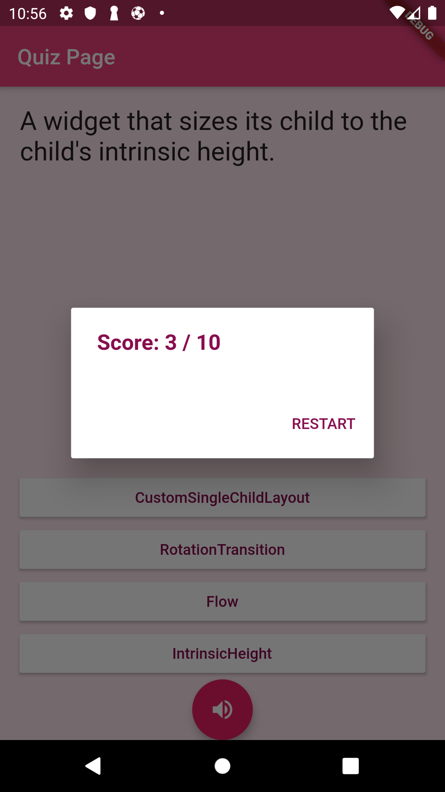

# Text To Speech Quiz Project  

The project is multiple quiz choice for Android and IOS using the flutter framework. This quiz will have 3 screens, the first screen to navigate to your quiz, the second screen is for the actual quiz and the last screen is for the summary.

- The navigation page will only have start button for now.
- The quiz screen will have a question, four choices and a button to speech the question.
- The summary page will have your final score, the button to restart the quiz, and the finish button.

## Motivation

15-20 percent of the worldwide population has some form language based leaning a language, and 14 percent of adutls in the US are illiterate and many have only basic reading skill. Therefore, making content audible will help people to better understand the text.
Text to Speech help user get better experience with content of application, such as thoses with literancy difficulties, learning disabilities, reduced vision, and those learning a language. It also opens door to anyone else looking for easier ways to access digital content.

## Installation and IDE

- [Get started with Flutter on Linux Ubuntu](https://link.medium.com/wnUcqyGaUZ)

- [Get started with Flutter on Windows](https://medium.com/@psyanite/get-started-with-flutter-on-windows-3d3fbb8b221a)

- [Get started with Flutter on Mac](https://medium.com/@sethladd/installing-flutter-on-a-mac-13a26340f80a)

## Code style

Follow effective dart style

[](https://dart.dev/guides/language/effective-dart/style)

## Screenshots

 

## Tech/framework used

<b>Built with</b> [Flutter](https://flutter.dev/)

For help getting started with Flutter, view
[online documentation](https://flutter.dev/docs), which offers tutorials,
samples, guidance on mobile development, and a full API reference.

## Features

- Text to Speech function.
- Ability to work offline.
- Responsive design for varying screen sizes.
- Push notification
- Feedback system
- Seemless UI

## Code Example

Implement flutter_tts package in code

### speak, getLanguages, getVoice

```dart
Future _getLanguages() async {
    languages = await flutterTts.getLanguages;
    if (languages != null) setState(() => languages);
  }

  Future _getVoices() async {
    voices = await flutterTts.getVoices;
    if (voices != null) setState(() => voices);
  }

  Future _speak() async {
    if (_newVoiceText != null) {
      if (_newVoiceText.isNotEmpty) {
        var result = await flutterTts.speak(_newVoiceText);
        if (result == 1) setState(() => ttsState = TtsState.playing);
      }
    }
  }
```

## Credits

[Flutter_tts](https://github.com/dlutton/flutter_tts)

## Have Fun

